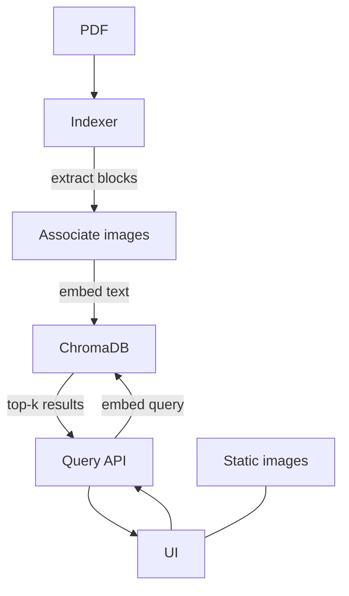
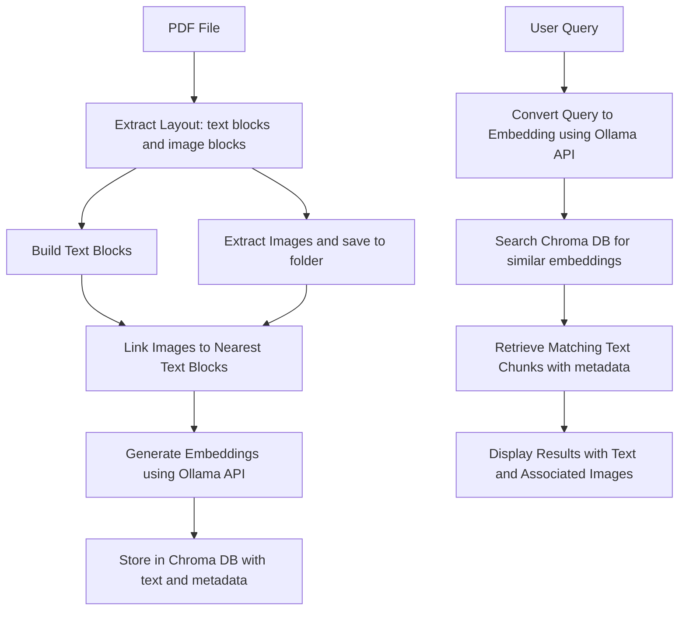

## Image-Enhanced RAG (Proof of Concept)

This PoC retrieves relevant text and only the relevant images from a PDF. It uses a Python backend for indexing and querying with ChromaDB and a simple Next.js UI for asking questions.

### What It Does
- **Indexes PDF into layout-aware chunks**: Extracts text blocks from each page and associates nearby/overlapping images using PDF bounding boxes.
- **Stores embeddings + metadata**: Text block embeddings are stored in ChromaDB with metadata: `page`, `bbox`, and a per-block list of `images`.
- **Serves images statically**: Saved PNGs are available at `/images/...` for the UI to render.
- **Queries by semantic similarity**: The API embeds the query via Ollama and returns only the matched text blocks with their own images.

### High-level flow


### How Does This Work
Normally, when you do semantic search on PDFs, you only embed plain text. The database doesn’t know where that text came from (page? position?) or if there were images nearby. In this POC, Every chunk of text is stored with metadata → page number, bounding box (position), and any attached images.

That means later when you search for something (e.g. "What is Next.js?"), the system won’t just return text, it can also:
- Tell you which page and where on the page that text was found.
- Show you any images that were attached to that block.

```json
{
    "results": [
        {
            "text": "Muhammad  Shahzad",
            "images": [
                "images/page1_img1.png"
            ],
            "page": 1,
            "bbox": "454.69921875,209.25,697.7479858398438,235.875",
            "distance": 70.56944274902344
        }
    ]
}
```

### Example:
If a PDF page says, “Next.js is a React framework…” and has the Next.js logo image nearby, a normal embedding search gives you the sentence only. This layout-aware search gives you the sentence plus the logo image path, so you can display both in your UI.



---

### Repository layout
- `rag-images-demo/`: Python index/query API (FastAPI), ChromaDB persistent store, image output.
  - `index.py`: Layout-aware indexing (text blocks + associated images) into ChromaDB.
  - `server.py`: FastAPI app exposing `/query` and serving `/images` statically.
  - `images/`: Extracted page images as PNGs.
  - `chroma_db/`: Persistent Chroma database.
- `rag-ui/`: Next.js minimal chat UI calling the `/query` API.

### Prerequisites
- Python 3.10+
- Node.js 18+
- [Ollama](https://ollama.com) running locally with the embedding model pulled:
  - `nomic-embed-text`

### Setup
```bash
# from repo root
pip install -r requirements.txt

# ensure the embedding model is available locally (in another terminal)
ollama pull nomic-embed-text
ollama serve
```

### Index a PDF
Set the PDF path in `rag-images-demo/index.py` (e.g., `sample5.pdf`). Then run:
```bash
python rag-images-demo/index.py
```
This creates text-block documents in ChromaDB and saves page images into `rag-images-demo/images/`. Each document stores only its relevant image paths.

### Run the API
```bash
uvicorn rag-images-demo.server:app --reload
```
- `POST /query` → `{ query: string }` returns an array of results: `text`, `images[]`, `page`, `bbox`, `distance`.
- Images are served at `/images/...` and map to files in `rag-images-demo/images/`.

### Run the UI
```bash
cd rag-ui
npm install
npm run dev
```
Open the app, ask a question, and it will display matched text with only the associated images for those text blocks.

### Notes
- Some PDFs contain vector graphics (not embedded images). Those won’t be returned as images without additional rendering logic. If needed, extend indexing to render page crops around text block boxes.
- The indexer currently resets and rebuilds the collection for a clean PoC run.


